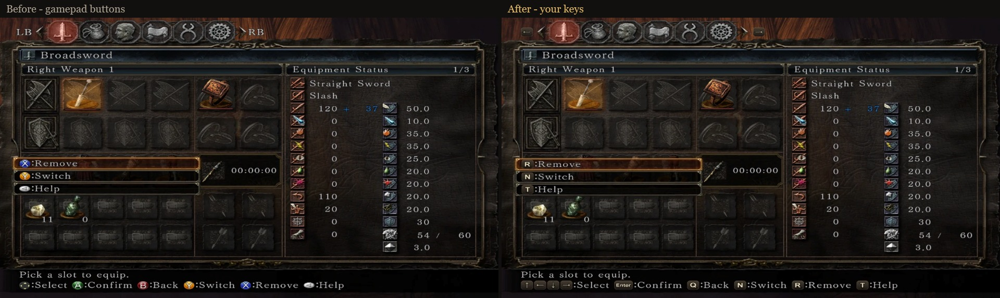
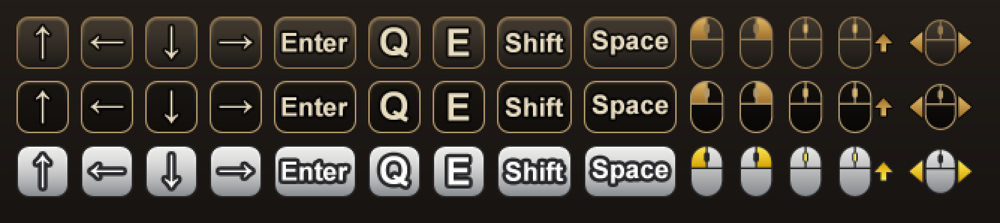

# Dynamic Key Prompts

**Dark Souls II: Scholar of the First Sin** always shows Xbox buttons in its prompts, even when you
play with keyboard and mouse. Existing mods only swap the button textures for fixed keys, which is
wrong as soon as you rebind anything.

Dynamic Key Prompts reads **your current key bindings** from the game and shows the matching key or
mouse button in every prompt — menus, the help bar, interaction prompts ("Rest at bonfire"),
tutorial messages — and updates immediately when you rebind a key.



- Key and mouse icons drawn in the game's style (three built-in themes, fully editable), or plain text labels
- Context aware: in menus A means *Confirm*, in the world it means *Interact* — each resolves to its own key
- Mouse buttons where you use them (attack = LMB, lock-on = MMB), keys elsewhere — configurable
- The game's files are not modified; delete one DLL to uninstall
- Works together with **Seamless Co-op**, **DS2 Lighting Engine** and **OptiScaler**

## Requirements

- Dark Souls II: Scholar of the First Sin, Steam, current version (1.0.3, build 9527516)
- Windows 10/11 x64

## Installation

1. Open the game folder: Steam → Dark Souls II: SotFS → Manage → Browse local files → `Game`.
2. Copy `dinput8.dll` and the `DynamicKeyPrompts` folder there
   (next to `DarkSoulsII.exe`).
3. Start the game as usual (also through `ds2sc_launcher.exe` for Seamless Co-op).

Uninstall: delete `dinput8.dll` and the `DynamicKeyPrompts` folder.

> The mod loads through `dinput8.dll`. If another mod already uses that file, use the alternative
> loader `xinput1_3.dll` (separate download) instead. With Ultimate ASI Loader, `dinput8.dll` can
> also be renamed to `DynamicKeyPrompts.asi` (not tested).

## Settings

`DynamicKeyPrompts\DynamicKeyPrompts.ini`:

| Setting | Values | |
|---|---|---|
| `Style` | `icons` / `text` | Key icons or text labels such as `[E]` |
| `IconTheme` | `dark` / `minimal` / `silver` / your own | Look of the icons |
| `Labels` | `auto` / `keyboard` / `mouse` / `both` | Which binding to show when an action has a key and a mouse button |
| `ShortNames`, `Format`, `Color` | | Text style options |
| `[Bindings]` | `<input id>=<text>` | Override the label of a single action |

### Custom icons



Each theme is one sprite sheet in `DynamicKeyPrompts\icons\`: `<theme>.png` with all icons and
`<theme>.txt` with the rectangle of every icon (`Name X Y Width Height`). The built-in sheets are
written there on first start. Edit a sheet, or copy `dark.png`/`dark.txt` to `mytheme.png`/`mytheme.txt`
and set `IconTheme=mytheme`. Icons are scaled to the game's text height, keeping their proportions;
the patched font is rebuilt automatically on the next start.

## Troubleshooting

`DynamicKeyPrompts\DynamicKeyPrompts.log` tells what the mod did. Set `Diagnostics=1` for a detailed
log; pressing F9 in game then writes your current bindings to it. Please attach the log when
[reporting a problem](https://github.com/HappyEntity/DS2-Dynamic-Key-Prompts/issues).

## How it works

- `dinput8.dll` (or `xinput1_3.dll`) is a small native loader: it forwards DirectInput / XInput to Windows, neuters the game's
  Arxan anti-tamper with [dearxan](https://github.com/tremwil/dearxan) before the game starts, and
  loads the main module.
- `DynamicKeyPrompts.dll` (C#, compiled to native code) hooks the game's text lookup, finds the
  gamepad button characters in each message and replaces them with the key bound to the same action,
  reading the bindings the game itself uses.
- Button icons in DS2 are characters of the game font. For icon mode the mod builds a copy of the
  font with extra key glyphs (in `DynamicKeyPrompts\cache`) and hands that copy to the game when it
  opens its font file.

## Building from source

Requirements: Visual Studio 2026 (C++ desktop development and .NET desktop development workloads),
.NET 10 SDK.

```powershell
pwsh .\build.ps1            # build into .\out\dist
pwsh .\build.ps1 -Install   # build and copy into the game folder (found through Steam, or -GameDir)
pwsh .\build.ps1 -Install -Loader xinput1_3   # same, with the alternative loader
pwsh .\build.ps1 -Package   # build and create the release zips in .\out (main + xinput1_3 loader)
```

`build.ps1` downloads dearxan on first run.

| Project | |
|---|---|
| `src/Loader` | `dinput8.dll` / `xinput1_3.dll` — C++ proxy loader (dearxan, MinHook); the `Proxy` property selects the variant |
| `src/Core` | `DynamicKeyPrompts.dll` — the mod (C#, NativeAOT) |
| `src/Common` | Game file formats (DCX, BND4, TPF, FMG, CCM, DDS) and key icon / font generation, shared by Core and Ds2Tool |
| `tools/Ds2Tool` | Command-line utility for the game's files, used during development (`Ds2Tool` without arguments lists its commands) |

## Credits

- [dearxan](https://github.com/tremwil/dearxan) by tremwil — Arxan neutering
- [MinHook](https://github.com/TsudaKageyu/minhook) by Tsuda Kageyu — function hooking
- [ds2-mods-rs](https://github.com/Banon-Labs/ds2-mods-rs) — reference for loading next to Seamless Co-op
- The Souls modding community for documenting the game's file formats

## License

[MIT](LICENSE). Third-party components: see [THIRD-PARTY-NOTICES.md](THIRD-PARTY-NOTICES.md).

---

## Кратко по-русски

Мод показывает в подсказках Dark Souls II: SotFS клавиши, которые **вы действительно назначили**,
вместо кнопок геймпада, и сразу обновляет их после переназначения. Установка: скопировать
`dinput8.dll` и папку `DynamicKeyPrompts` в папку `Game` рядом с `DarkSoulsII.exe`. Настройки — в
`DynamicKeyPrompts\DynamicKeyPrompts.ini`, свои значки — в `DynamicKeyPrompts\icons\`. Совместим с
Seamless Co-op, DS2 Lighting Engine и OptiScaler.
